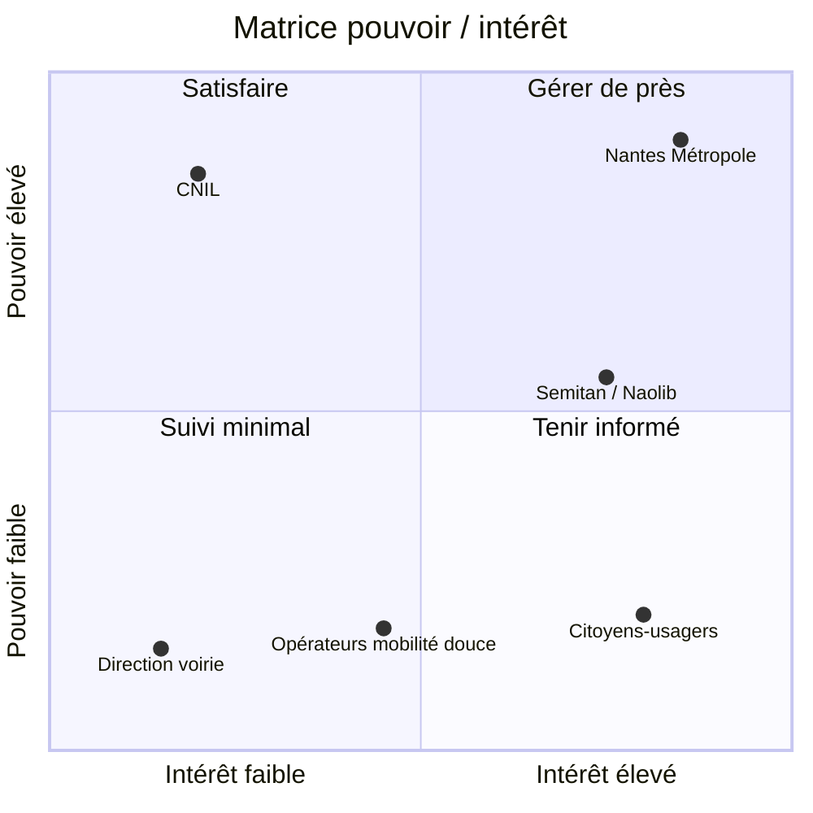
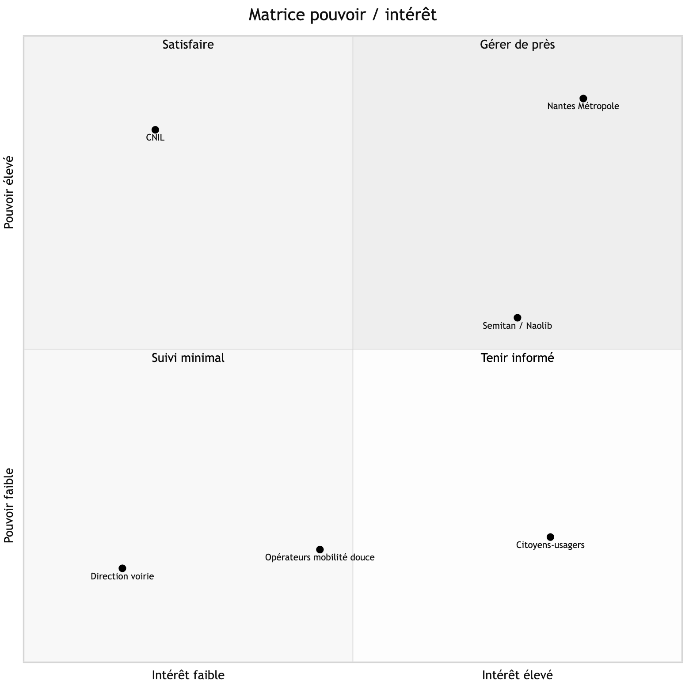

# A2, Matrice pouvoir/intérêt

## Description

La matrice positionne les six acteurs identifiés en A2 selon les mêmes valeurs Pouvoir/Intérêt que le tableau de la section Contexte, répartis en quatre zones d'action.

**Gérer de près (pouvoir élevé, intérêt élevé).** Nantes Métropole est commanditaire, financeur et valideur des livrables : elle exige une communication rapprochée et continue tout au long du projet. Semitan/Naolib se situe à la frontière haute de cette zone : opérateur du réseau et fournisseur des données GTFS/SIRI, sans son accord opérationnel l'intégration temps réel prévue en V2 ne peut pas avancer.

**Satisfaire (pouvoir élevé, intérêt faible).** La CNIL n'intervient pas dans les choix produit au quotidien, mais dispose d'un pouvoir de sanction élevé sur tout traitement de données de géolocalisation non conforme. La conformité RGPD doit rester irréprochable sans qu'un dialogue actif soit nécessaire.

**Tenir informé (pouvoir faible, intérêt élevé).** Les citoyens-usagers n'ont aucun levier de décision sur le projet, mais leur adoption est le KPI politique central de la collectivité : leurs retours d'usage doivent remonter même sans pouvoir formel de leur part.

**Suivi minimal (pouvoir faible, intérêt faible).** La Direction voirie de Nantes Métropole, destinataire potentiel du signalement collaboratif reporté en V2, n'a pas d'impact sur le périmètre MVP actuel. Les opérateurs de mobilité douce (Bicloo, trottinettes) se situent à la frontière de cette zone : simples fournisseurs de données GBFS consommées en lecture seule, sans contrat direct au MVP.
