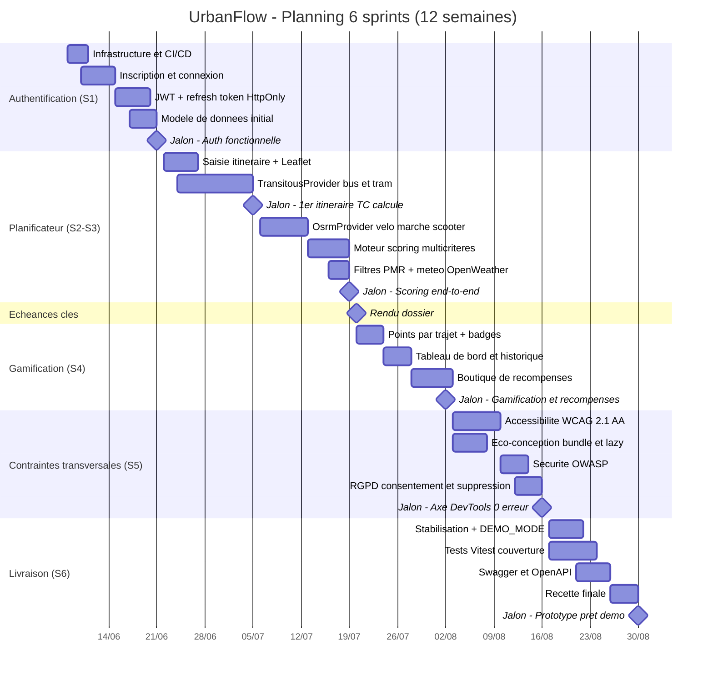

# B5 - Diagramme de Gantt

Planification des 6 sprints (12 semaines) par module fonctionnel, avec jalons de fin de sprint.

```mermaid
gantt
    title UrbanFlow - Planning 6 sprints (12 semaines)
    dateFormat YYYY-MM-DD
    axisFormat %d/%m

    section Authentification (S1)
    Infrastructure et CI/CD             :2026-06-08, 3d
    Inscription et connexion            :2026-06-10, 5d
    JWT + refresh token HttpOnly        :2026-06-15, 5d
    Modele de donnees initial           :2026-06-17, 4d
    Jalon - Auth fonctionnelle          :milestone, m1, 2026-06-21, 0d

    section Planificateur (S2-S3)
    Saisie itineraire + Leaflet         :2026-06-22, 5d
    TransitousProvider bus et tram      :2026-06-24, 11d
    Jalon - 1er itineraire TC calcule   :milestone, m2, 2026-07-05, 0d
    OsrmProvider velo marche scooter    :2026-07-06, 7d
    Moteur scoring multicriteres        :2026-07-13, 6d
    Filtres PMR + meteo OpenWeather     :2026-07-16, 3d
    Jalon - Scoring end-to-end          :milestone, m3, 2026-07-19, 0d

    section Echeances cles
    Rendu dossier                       :milestone, rendu, 2026-07-20, 0d

    section Gamification (S4)
    Points par trajet + badges          :2026-07-20, 4d
    Tableau de bord et historique       :2026-07-24, 4d
    Boutique de recompenses             :2026-07-28, 6d
    Jalon - Gamification et recompenses :milestone, m4, 2026-08-02, 0d

    section Contraintes transversales (S5)
    Accessibilite WCAG 2.1 AA           :2026-08-03, 7d
    Eco-conception bundle et lazy       :2026-08-03, 5d
    Securite OWASP                      :2026-08-10, 4d
    RGPD consentement et suppression    :2026-08-12, 4d
    Jalon - Axe DevTools 0 erreur       :milestone, m5, 2026-08-16, 0d

    section Livraison (S6)
    Stabilisation + DEMO_MODE           :2026-08-17, 5d
    Tests Vitest couverture             :2026-08-17, 7d
    Swagger et OpenAPI                  :2026-08-21, 5d
    Recette finale                      :2026-08-26, 4d
    Jalon - Prototype pret demo         :milestone, m6, 2026-08-30, 0d
```
