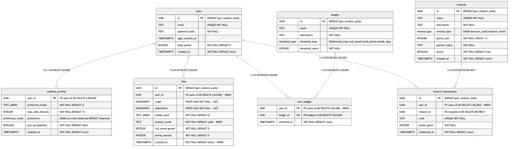

# Phase D : Spécifications du planificateur multimodal

Le planificateur multimodal est la fonctionnalité centrale de la solution. Il agrège les itinéraires issus de plusieurs providers de transport, applique des filtres selon le profil utilisateur et trie les résultats via un moteur de scoring multicritères. Cette section détaille ses spécifications fonctionnelles et techniques.

---

## D1. Spécifications fonctionnelles

### Parcours utilisateur nominal

L'utilisateur authentifié arrive sur la carte, centrée par défaut sur la place du Commerce (latitude 47.218, longitude -1.553, centre de Nantes Métropole). Un bouton de localisation lui propose d'utiliser sa position GPS. S'il accepte, le champ "départ" se remplit automatiquement via l'API de géolocalisation du navigateur. Il peut aussi saisir une adresse manuellement.

> **[À CRÉER]** _Maquette du parcours planificateur_ : série de 4 écrans (carte d'accueil, formulaire de saisie, liste de résultats, détail d'un itinéraire). Les wireframes ASCII et les spécifications visuelles détaillées de ces quatre écrans existent déjà dans `docs/design/MAQUETTE.md` (Écrans 4 à 7). Reste à produire : le rendu visuel Figma depuis ces wireframes. Format mobile 375 px. Insérer en grille 2 x 2.

L'utilisateur saisit sa destination, sélectionne les modes souhaités parmi sept options (bus, tramway, navibus, train, vélo, marche, scooter électrique), choisit un profil de préférence (eco, rapide, équilibré) et soumet le formulaire. La validation côté client s'exécute avant tout envoi réseau. Si un champ obligatoire est absent ou mal formé, un message d'erreur précis apparaît directement sous le champ concerné.

Le système calcule les itinéraires et renvoie une liste triée par score décroissant, affichée dans un panneau glissant au-dessus de la carte. Chaque itinéraire présente la durée totale, la distance, le score CO2, l'économie en grammes comparée à un trajet en voiture, et les modes représentés par des icônes. L'utilisateur sélectionne un itinéraire pour en consulter le détail : liste des segments, horaires de correspondance et tracé sur la carte.

### User stories et critères d'acceptation

Les critères d'acceptation suivent le format Gherkin (langage structuré Étant donné / Quand / Alors, permettant d'exprimer des scénarios de test lisibles par toutes les parties prenantes).

**US-01. Calcul d'itinéraire multimodal**

> En tant que citoyen authentifié, je veux saisir une origine et une destination pour obtenir une liste d'itinéraires multimodaux triés.

```
Scénario : calcul réussi
  Étant donné que je suis connecté
  Et que j'ai saisi une adresse de départ et une adresse d'arrivée valides
  Et que j'ai sélectionné au moins un mode de transport
  Quand je soumets le formulaire de planification
  Alors le système affiche au moins un itinéraire dans les 2 secondes
  Et les itinéraires sont triés par score décroissant selon le profil actif

Scénario : champ obligatoire manquant
  Étant donné que le champ "destination" est vide
  Quand je tente de soumettre le formulaire
  Alors un message "Destination requise" s'affiche sous le champ concerné
  Et aucun appel réseau n'est déclenché
```

**US-02. Profil de préférence**

> En tant que citoyen, je veux choisir un profil de préférence pour que les itinéraires proposés correspondent à ma priorité du moment.

```
Scénario : profil eco
  Étant donné que j'ai sélectionné le profil "eco"
  Quand les résultats sont affichés
  Alors les itinéraires sont triés par score pondéré où le critère CO2 pèse 70 % du score final
  Et l'itinéraire en tête de liste porte le badge de profil "Eco"
```

Le profil "eco" ne garantit pas que l'itinéraire le plus sobre en CO2 apparaisse toujours en tête : la pondération conserve 20 % de poids sur la durée et 10 % sur le confort, de sorte qu'un itinéraire légèrement moins sobre mais nettement plus rapide peut le devancer. C'est le comportement attendu d'un moteur multicritères, qui arbitre entre plusieurs objectifs plutôt que d'optimiser un seul critère de façon absolue.

**US-03. Filtre accessibilité PMR**

> En tant que citoyen à mobilité réduite, je veux activer un filtre PMR pour n'obtenir que des itinéraires compatibles avec mes contraintes de déplacement.

```
Scénario : filtre PMR actif, itinéraires compatibles disponibles
  Étant donné que j'ai activé le filtre PMR dans mon profil
  Quand je calcule un itinéraire
  Alors aucun itinéraire retourné ne comporte un segment de marche supérieur à 5 minutes
  Et les itinéraires comportant un segment vélo sont absents ou fortement pénalisés

Scénario : aucun itinéraire compatible PMR
  Étant donné que le filtre PMR est actif
  Et qu'aucun itinéraire ne satisfait la contrainte de 5 minutes de marche maximum
  Quand le calcul est terminé
  Alors le système affiche le message "Aucun itinéraire accessible trouvé pour ce trajet"
  Et propose à l'utilisateur d'assouplir ses filtres
```

**US-04. Géolocalisation et saisie manuelle**

> En tant que citoyen, je veux utiliser ma position GPS pour préremplir le point de départ, et pouvoir saisir manuellement si je refuse la géolocalisation.

```
Scénario : permission de géolocalisation accordée
  Étant donné que j'ai accordé la permission de géolocalisation
  Quand j'ouvre le planificateur
  Alors le champ "départ" est prérempli avec mes coordonnées GPS
  Et une adresse approximative est affichée (géocodage inverse)

Scénario : permission de géolocalisation refusée
  Étant donné que j'ai refusé la permission de géolocalisation
  Quand j'ouvre le planificateur
  Alors le champ "départ" reste vide et éditable
  Et le message "Saisissez votre adresse de départ" invite à la saisie manuelle
```

**US-05. Affichage de l'empreinte carbone**

> En tant que citoyen, je veux voir l'empreinte carbone de chaque itinéraire et l'économie réalisée par rapport à un trajet en voiture.

```
Scénario : affichage CO2
  Étant donné que des itinéraires sont affichés
  Quand je consulte la liste des résultats
  Alors chaque itinéraire affiche son empreinte en grammes d'équivalent CO2
  Et l'économie en grammes comparée au trajet équivalent en voiture particulière
```

### Règles de gestion

**Pondérations par profil de préférence**

Le moteur applique trois coefficients dont la somme est toujours égale à 1.0.

| Profil | Coefficient durée | Coefficient CO2 | Coefficient confort |
|---|---|---|---|
| eco | 0.2 | 0.7 | 0.1 |
| rapide | 0.7 | 0.2 | 0.1 |
| équilibré | 0.4 | 0.5 | 0.1 |

**Filtres durs appliqués avant le scoring**

Deux filtres éliminent des itinéraires avant que le calcul de score ne s'exécute. Le filtre de modes supprime tout itinéraire dont un segment utilise un mode non sélectionné par l'utilisateur. La marche est toujours tolérée, quel que soit le filtre actif, car elle est inévitable dans les correspondances. Le filtre `maxWalkMinutes` élimine les itinéraires dont un segment de marche dépasse le seuil configuré (valeur par défaut : 15 minutes). Quand le filtre PMR est actif, ce seuil est réduit à la valeur minimale entre `maxWalkMinutes` et 5 minutes.

**Règle Bicloo**

OsrmProvider refuse de construire un itinéraire incluant une station Bicloo si la station de départ la plus proche dépasse 1,5 km de marche depuis le point de départ. Ce seuil évite de proposer des segments de marche absurdes qui dégraderaient l'expérience utilisateur sans alternative viable.

**Pénalités PMR dans le score de confort**

Quand le filtre PMR est actif, la pénalité sur un segment de marche dépassant le seuil est portée à 60 points (contre 40 en mode standard). Tout itinéraire comportant un segment vélo reçoit une pénalité supplémentaire de 50 points sur le score de confort.

---

## D2. Spécifications techniques

### Contrat d'API

Le planificateur expose un seul endpoint.

```
POST /api/routing/journeys
```

Authentification requise via un token JWT (JSON Web Token) dans le header `Authorization: Bearer <token>`.

**Corps de la requête (validé par middleware Zod)**

```typescript
{
  from: {
    lat: number,   // entre 47.0 et 47.5 (emprise Nantes Métropole)
    lng: number    // entre -2.0 et -1.0
  },
  to: {
    lat: number,
    lng: number
  },
  modes: Array<'bus' | 'tramway' | 'navibus' | 'train' | 'bike' | 'walk' | 'scooter'>,
  preference: 'eco' | 'fast' | 'balanced',
  pmrAccessibility: boolean,
  maxWalkMinutes?: number,    // optionnel, défaut 15
  departureTime?: string      // optionnel, ISO 8601
}
```

**Corps de la réponse (200)**

```typescript
{
  journeys: Array<{
    id: string,
    totalDurationMin: number,
    totalDistanceKm: number,
    totalCo2g: number,
    co2SavedVsCarG: number,
    score: number,            // score final entre 0 et 100
    segments: Array<{
      mode: string,
      from: { lat: number, lng: number },
      to: { lat: number, lng: number },
      durationMin: number,
      distanceKm: number,
      co2g: number,
      geometry: GeoJSON.LineString,  // GeoJSON : format ouvert d'échange de données géographiques
      line?: string,                 // ex. "C1" pour le tramway ligne 1
      direction?: string
    }>
  }>
}
```

**Codes d'erreur**

| Code HTTP | Cas |
|---|---|
| 400 | Corps invalide : champ manquant, type incorrect, coordonnées hors zone |
| 401 | Token absent ou expiré |
| 404 | Aucun itinéraire trouvé pour les paramètres donnés |
| 503 | Les deux providers externes sont en timeout et DEMO_MODE est désactivé |

**Note sur OsrmProvider**

Le serveur public OSRM (Open Source Routing Machine, moteur de routage open source) ne propose que le profil de calcul routier voiture. OsrmProvider récupère la géométrie et la distance depuis ce profil, puis calcule la durée de chaque segment depuis des vitesses constantes par mode : 15 km/h pour le vélo, 5 km/h pour la marche, 20 km/h pour le scooter électrique. Cette approximation est documentée et acceptable pour un MVP.

### Algorithme de scoring multicritères

Le moteur est entièrement déterministe. Aucun composant statistique ni aucun modèle d'apprentissage n'entre dans son calcul.

**Formule générale**

```
score_final = (w_durée × score_durée) + (w_CO2 × score_CO2) + (w_confort × score_confort)
```

**Score de durée**

La durée de référence est fixée à 120 minutes. Un itinéraire de 0 minute obtiendrait un score de 100 ; un itinéraire de 120 minutes ou plus obtient 0.

```
score_durée = max(0, 100 - (totalDurationMin / 120) × 100)
```

**Score CO2**

Le score CO2 compare l'empreinte de l'itinéraire à celle du trajet équivalent en voiture particulière. Le facteur voiture retenu est 253 g CO2e/km, issu de la Base Empreinte de l'ADEME (Agence de la transition écologique).

```
score_CO2 = max(0, (1 - totalCo2g / (totalDistKm × 253)) × 100)
```

Facteurs CO2 par mode (source : Base Empreinte ADEME, g CO2e/km par passager, phase d'usage) :

| Mode | Facteur (g CO2e/km) |
|---|---|
| Voiture particulière (référence) | 253 |
| Bus | 109 |
| Tramway | 4 |
| Navibus | 50 |
| Train TER électrifié | 14 |
| Vélo | 0 |
| Marche | 0 |
| Scooter électrique | 0 |

Ces facteurs couvrent uniquement la phase d'usage du déplacement, c'est-à-dire les émissions directes produites pendant le trajet, à l'exclusion de la fabrication du véhicule et de sa fin de vie (analyse de cycle de vie). C'est ce périmètre qui justifie un facteur nul pour le vélo, la marche et le scooter électrique : aucun de ces trois modes n'émet directement de CO2 pendant le déplacement. Une analyse de cycle de vie complète, hors périmètre MVP, attribuerait un facteur non nul à la fabrication d'un scooter électrique et de sa batterie.

L'empreinte totale d'un itinéraire est la somme des produits (distance du segment en km × facteur du mode) pour chaque segment. L'économie CO2 est la différence entre l'empreinte du trajet équivalent en voiture et l'empreinte calculée.

**Score de confort**

Le score de confort mesure le ratio de segments dont le mode est inclus dans les préférences de l'utilisateur, rapporté à 100. Des pénalités et un bonus ponctuel l'ajustent ensuite, selon les segments de l'itinéraire et, quand elle est disponible, la donnée météo du point de départ, conformément au diagramme de séquences qui transmet cette donnée au moteur de scoring. La météo provient du cache OpenWeatherMap décrit dans la section consacrée à l'architecture (TTL de 10 minutes).

| Situation | Ajustement |
|---|---|
| Segment marche dépassant le seuil standard (15 min) | -40 points |
| Segment marche dépassant le seuil PMR (5 min) | -60 points |
| Segment vélo si filtre PMR actif | -50 points |
| Conditions humides (pluie, neige, orage) ou vent supérieur à 40 km/h, sur un itinéraire comportant un segment vélo | -30 points |
| Conditions humides (pluie, neige, orage), itinéraire entièrement en transport en commun (sans segment vélo) | +10 points |

Le bonus par temps humide valorise les modes couverts (bus, tramway, navibus, train) quand la pluie dégrade le confort perçu des modes actifs. Il ne s'applique pas si l'itinéraire comporte un segment vélo, même combiné à un segment de transport en commun. Le score de confort reste borné entre 0 et 100 après application de l'ensemble des ajustements.

### Modèle de données

Le planificateur interagit avec trois tables PostgreSQL. L'extension PostGIS est requise pour les requêtes géospatiales sur les coordonnées GPS. Le schéma complet, incluant les tables de gamification et de récompenses, est détaillé dans la section consacrée à l'architecture technique.


> _Rendu du schéma entités-relations complet (ces trois tables et celles de la gamification), généré depuis le source Mermaid de la section consacrée à l'architecture technique._

**Table `users`** (partagée avec le module d'authentification)

| Colonne | Type | Contrainte |
|---|---|---|
| id | UUID | PK, DEFAULT gen_random_uuid() |
| email | TEXT | UNIQUE, NOT NULL |
| password_hash | TEXT | NOT NULL |
| rgpd_consent_at | TIMESTAMPTZ | horodatage du consentement RGPD |
| total_points | INTEGER | NOT NULL, DEFAULT 0 |
| created_at | TIMESTAMPTZ | NOT NULL, DEFAULT now() |

**Table `mobility_profiles`**

| Colonne | Type | Contrainte |
|---|---|---|
| user_id | UUID | PK, FK users.id ON DELETE CASCADE |
| preferred_modes | TEXT[] | NOT NULL, DEFAULT {} |
| max_walk_minutes | INTEGER | NOT NULL, DEFAULT 15 |
| preference | ENUM('eco', 'fast', 'balanced') | DEFAULT 'balanced' |
| pmr_accessibility | BOOLEAN | NOT NULL, DEFAULT false |
| updated_at | TIMESTAMPTZ | NOT NULL, DEFAULT now() |

**Table `trips`** (alimente le tableau de bord citoyen et la gamification)

| Colonne | Type | Contrainte |
|---|---|---|
| id | UUID | PK, DEFAULT gen_random_uuid() |
| user_id | UUID | FK users.id ON DELETE CASCADE, INDEX |
| origin | GEOGRAPHY(POINT, 4326) | NOT NULL, index GiST |
| destination | GEOGRAPHY(POINT, 4326) | NOT NULL, index GiST |
| modes_used | TEXT[] | NOT NULL, DEFAULT {} |
| primary_mode | TEXT | NOT NULL, DEFAULT 'walk', INDEX |
| co2_saved_grams | INTEGER | NOT NULL, DEFAULT 0 |
| points_earned | INTEGER | NOT NULL, DEFAULT 0 |
| created_at | TIMESTAMPTZ | NOT NULL, DEFAULT now(), INDEX |

La durée totale, la distance totale et le score renvoyés par l'endpoint de calcul sont des indicateurs calculés à la volée par le moteur de scoring. Ils ne sont pas persistés : seuls les indicateurs de synthèse nécessaires au tableau de bord et à la gamification (économie CO2, points gagnés) sont conservés dans `trips`.

La rétention des enregistrements `trips` est limitée à 12 mois, conformément à la politique définie dans la section consacrée aux contraintes RGPD. Un job planifié supprime les enregistrements dont `created_at` est antérieur à cette limite.

---

## D3. Cas limites et comportements de protection

Le principe de "fail fast" (échouer tôt, de manière explicite) est appliqué à chaque point d'entrée du planificateur. Chaque cas limite dispose d'un comportement défini, visible et explicite pour l'utilisateur.

**Géolocalisation refusée ou indisponible.** Quand l'utilisateur refuse la permission ou que le navigateur ne prend pas en charge l'API de géolocalisation, le champ "départ" reste vide et éditable. Un message invite à saisir l'adresse manuellement. Aucune logique alternative ne tente d'inférer la position. Ce comportement est conforme à l'exigence de consentement explicite définie dans la section sur les contraintes RGPD.

**Timeout d'un provider externe.** Chaque appel aux APIs de transport est encapsulé dans un timeout de 5 secondes. Si un provider dépasse ce délai, `routing.service` utilise les résultats du provider disponible. Si les deux providers sont en timeout, le système renvoie une erreur 503 et l'interface affiche le message "Service de calcul temporairement indisponible". En environnement de démonstration (`DEMO_MODE=true`), ce cas ne peut pas survenir : DemoProvider répond depuis des fichiers JSON statiques sans aucune dépendance réseau.

**Aucun itinéraire trouvé.** Si les filtres durs éliminent tous les itinéraires candidats (aucun mode compatible, contrainte PMR trop restrictive, zone non couverte), le système renvoie une erreur 404 avec un corps JSON structuré indiquant la raison. Ce choix traite l'absence de résultat comme une ressource introuvable pour la combinaison de paramètres soumise (origine, destination, modes, contraintes), plutôt que comme une liste vide valide : la requête ne peut structurellement pas aboutir tant que l'utilisateur ne modifie pas ses critères, ce qui la distingue d'une recherche simplement infructueuse. L'interface affiche un message explicite et propose à l'utilisateur d'assouplir ses filtres.

**Coordonnées hors zone nantaise.** Le schéma Zod de validation inclut des contraintes de borne sur les coordonnées GPS : latitude entre 47.0 et 47.5, longitude entre -2.0 et -1.0 (emprise de Nantes Métropole). Toute requête hors de cette zone retourne une erreur 400 avec le message "Coordonnées hors de la zone de service".

**Station Bicloo trop éloignée.** OsrmProvider vérifie, avant de construire un segment Bicloo, que la station la plus proche du point de départ est à moins de 1,5 km de marche. Au-delà de ce seuil, le segment Bicloo est abandonné silencieusement. L'itinéraire est construit sans ce segment ou avec un mode de remplacement si un autre provider le couvre.

---

## D4. Règles de gestion complémentaires : boutique de récompenses

Le module de gamification inclut une boutique de récompenses, qui permet à un citoyen d'échanger les points accumulés lors de ses trajets contre des avantages proposés par des partenaires locaux. Cette fonctionnalité répond directement à la demande de "gamification avec récompenses" formulée dans le besoin client.

**Catalogue et partenaires.** Chaque récompense appartient à l'un de deux types : code de réduction (`discount_code`) ou billet d'entrée (`museum_ticket`). Le périmètre MVP retient des partenaires ancrés dans la métropole nantaise : Bicloo (une heure de location offerte, 120 points), Naolib (réduction de 20 % sur un titre de transport unitaire, 150 points), Le Voyage à Nantes (Pass visite à -30 %, 400 points), ainsi que des billets d'entrée pour le Planétarium, le Muséum d'histoire naturelle, le Musée d'Arts et le Château des Ducs de Bretagne (de 500 à 900 points selon le partenaire). Une récompense désactivée (`active = false`) disparaît du catalogue proposé mais reste visible dans l'historique des échanges déjà réalisés.

**Coût en points.** Le coût de chaque récompense est fixé au niveau du catalogue, pas calculé dynamiquement. Un citoyen ne peut échanger une récompense que si son solde de points cumulé est supérieur ou égal au coût affiché.

**Code unique de récompense.** Chaque échange génère un code au format `RDM-XXXXXXXX` (8 caractères hexadécimaux dérivés d'un UUID). L'unicité est garantie par une contrainte `UNIQUE` en base ; en cas de collision, rare mais possible, le système régénère un nouveau code jusqu'à 3 tentatives avant d'échouer.

**Atomicité de l'échange.** Le débit du solde de points et la création de l'enregistrement d'échange s'exécutent dans une seule transaction. Le débit est conditionnel (`UPDATE ... WHERE total_points >= coût`), ce qui élimine tout risque de solde négatif en cas d'échanges simultanés sur le même compte, sans recourir à un verrou explicite.

**Cas d'erreur.** Trois cas sont distingués et renvoyés avec un code HTTP adapté : récompense introuvable (404), récompense désactivée ou solde insuffisant (409), fréquence d'échange excessive (429, plafond de 30 échanges par heure et par utilisateur).

---

## D5. Traçabilité besoin vers spécification vers code vers test

Le tableau suivant relie chaque user story à l'endpoint correspondant, au fichier d'implémentation principal et au test Vitest associé. Cette traçabilité garantit que chaque besoin fonctionnel est couvert à chaque couche de la solution.

| User story | Endpoint | Fichier d'implémentation | Test Vitest |
|---|---|---|---|
| US-01 : calcul d'itinéraire | POST /api/routing/journeys | `server/modules/routing/routing.service.ts` | `routing.service.test.ts` : scénarios TC + modes actifs |
| US-02 : profil de préférence | POST /api/routing/journeys (champ `preference`) | `server/modules/routing/scoring.service.ts` | `scoring.service.test.ts` : vérification de l'ordre de tri par profil |
| US-03 : filtre PMR | POST /api/routing/journeys (champ `pmrAccessibility`) | `routing.service.ts` (filtres) + `scoring.service.ts` (pénalités) | `routing.service.test.ts` : scénarios filtre PMR et pénalités |
| US-04 : géolocalisation et saisie manuelle | Pas d'endpoint (logique frontend) | `src/client/hooks/useGeolocation.ts` + `src/client/components/JourneyForm.tsx` | `useGeolocation.test.ts` : permission accordée et refusée (mock API) |
| US-05 : empreinte carbone | POST /api/routing/journeys (champs `totalCo2g`, `co2SavedVsCarG`) | `server/modules/routing/scoring.service.ts` | `scoring.service.test.ts` : vérification des facteurs ADEME par mode |
