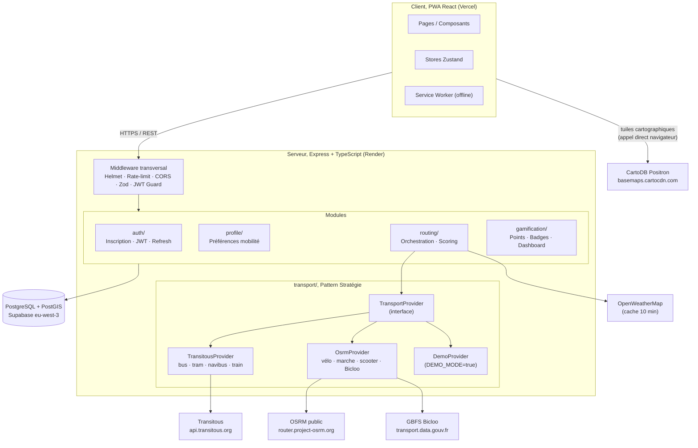
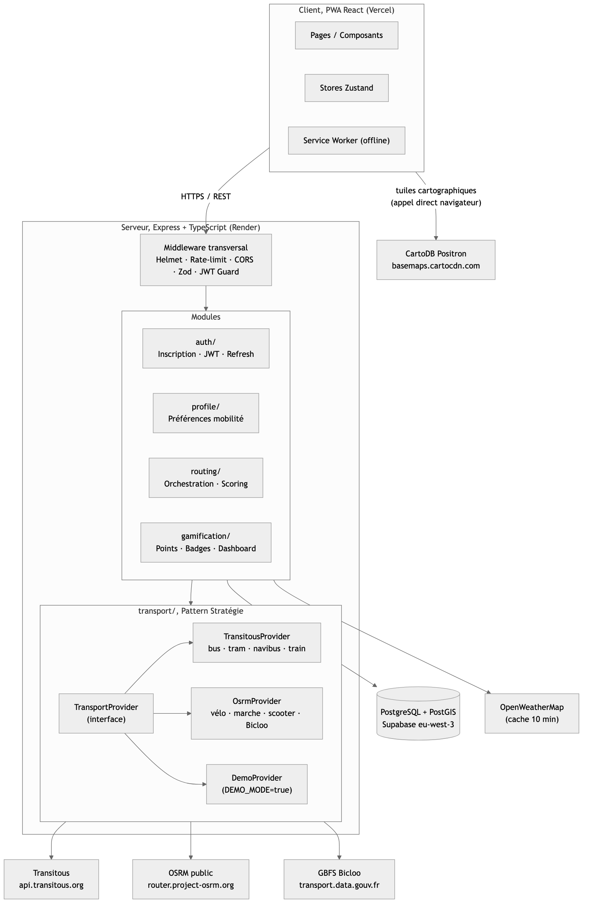

# Phase E : Architecture technique

---

## E1. Architecture globale

La solution s'articule en trois couches. Le frontend est une PWA (Progressive Web App) React servie depuis Vercel. Le backend est un serveur Express modulaire hébergé sur Render, exposant une API REST documentée. La base de données PostgreSQL avec l'extension PostGIS est hébergée sur Supabase en région eu-west-3. Quatre des cinq APIs externes (Transitous, OSRM, OpenWeatherMap, GBFS Bicloo) sont accessibles uniquement depuis le backend, jamais depuis le client : aucune clé d'API ne transite dans le navigateur, et les coordonnées GPS saisies par l'utilisateur ne sont jamais transmises directement à un tiers depuis le poste client. La cinquième, CartoDB (tuiles cartographiques), est appelée directement par Leaflet depuis le navigateur : chaque requête de tuile révèle au fournisseur la zone géographique affichée à l'écran, sans coordonnée exacte, donnée nominative ni identifiant de compte. C'est la seule exception à la règle de centralisation backend, documentée comme telle.





> **[À CRÉER]** _Polish optionnel_ : le rendu ci-dessus (généré depuis le source Mermaid) est directement exploitable pour le PDF. Une passe supplémentaire dans draw.io ou Figma (icônes Vercel/Render/Supabase, légende des couleurs par couche) reste possible mais n'est plus bloquante.

Le middleware transversal (Helmet, rate-limit, CORS, validation Zod, contrôle JWT) s'applique en amont de chaque handler de route. Cette centralisation garantit qu'aucune entrée utilisateur n'atteint la logique métier sans avoir été validée, et qu'aucune réponse ne franchit la couche HTTP sans les en-têtes de sécurité requis.

Le module `routing` est le seul point d'entrée vers la couche transport. Il n'appelle jamais directement Transitous ou OSRM : il délègue à l'interface `TransportProvider`, décrite dans la section suivante.

---

## E2. Monolithe modulaire : justification et chemin vers l'évolutivité

Comme justifié dans la section Pilotage, les microservices sont écartés au nom du principe YAGNI (You Aren't Gonna Need It). Sur un MVP développé par une seule personne en douze semaines, ils introduiraient un surcoût opérationnel sans bénéfice fonctionnel : service discovery, tracing distribué, gestion de transactions inter-services, pipelines de déploiement indépendants pour chaque service.

Ce que le monolithe modulaire garantit, que les microservices auraient garanti aussi : les frontières entre modules sont strictes. `routing` n'importe jamais depuis `gamification`. `auth` ne connaît pas `profile`. Le répertoire `server/modules/` matérialise ces frontières dans la structure même du code source.

Ce que cette discipline rend possible en V2 : l'extraction d'un module en service indépendant ne requiert pas de réécriture fonctionnelle. La séparation est effective au niveau du code ; ajouter une couche de communication HTTP ou un bus de messages entre modules est un changement de transport, pas un changement de logique.

---

## E3. Pattern Stratégie : preuve concrète d'extensibilité

Le pattern Stratégie est le point architectural central de la solution. Le module `routing` ne connaît jamais directement Transitous, OSRM ni aucun provider. Il interagit exclusivement avec l'interface `TransportProvider` définie dans `server/modules/transport/transport-provider.interface.ts` :

```typescript
export interface TransportProvider {
  readonly supportedModes: TransportMode[]
  getJourneys(
    from: Coordinates,
    to: Coordinates,
    options: JourneyOptions
  ): Promise<Journey[]>
}
```

Trois implémentations sont prévues pour le MVP :

| Implémentation | Modes couverts | Source de données |
|---|---|---|
| `TransitousProvider` | bus, tramway, navibus, train | api.transitous.org, format MOTIS/OTP |
| `OsrmProvider` | vélo, marche, scooter électrique, stations Bicloo | router.project-osrm.org (vitesses constantes par mode) + GBFS Bicloo via transport.data.gouv.fr |
| `DemoProvider` | tous les modes | Fichiers JSON statiques dans `demo-data/` |

La fonction `selectProviders()` dans `routing.service.ts` sélectionne les providers selon les modes demandés par l'utilisateur : au moins un mode TC active `TransitousProvider`, au moins un mode actif active `OsrmProvider`. Si la variable d'environnement `DEMO_MODE=true`, seul `DemoProvider` est instancié, quelle que soit la sélection. Les appels aux providers retenus sont parallélisés via `Promise.all()`, ce qui permet d'atteindre la cible de p95 inférieur à 2 secondes documentée dans la section Pilotage.

**Extension en V2 sans modification du module routing.** Intégrer les données SIRI-Lite en temps réel, ajouter un opérateur de covoiturage ou un nouveau réseau TC se résume à écrire une classe qui implémente `TransportProvider` et à l'inclure dans la logique de `selectProviders()`. Aucune ligne du module `routing` n'est modifiée. Cette garantie d'extension sans régression est la traduction directe du principe OCP (Open/Closed Principle) : le module de routage est ouvert à l'extension, fermé à la modification.

---

## E4. Maintenabilité

**TypeScript strict.** L'option `"strict": true` active l'ensemble des contrôles statiques : vérifications de nullabilité, interdiction implicite du type `any`, inférence de retour. Toute erreur de type est bloquante à la compilation. Le type `unknown` est utilisé à la place de `any` aux frontières du système (réponses d'API externe, paramètres de routes), suivi d'un type guard explicite.

**Types partagés front/back.** Le répertoire `shared/types/` contient les interfaces communes aux deux parties de l'application : `Journey`, `JourneySegment`, `Coordinates`, `TransportMode`, entre autres. Un changement de contrat d'API se propage automatiquement aux deux côtés via le compilateur TypeScript. Aucune désynchronisation entre le schéma de réponse du backend et les types consommés par le frontend n'est possible sans erreur de compilation.

**Séparation controller / service / middleware.** Dans chaque module backend, le controller parse la requête HTTP et renvoie la réponse structurée. La logique métier est dans le service. La validation des entrées est un middleware Zod déclaré sur la route, jamais dans le controller. Cette séparation permet de tester les services indépendamment de la couche HTTP (pas de mock de `req`/`res`), et de réutiliser la logique de validation dans d'autres contextes.

**Migrations SQL versionnées.** Les évolutions de schéma sont stockées dans `server/db/migrations/` avec un préfixe numérique séquentiel : `001-create-users.sql`, `002-create-profiles.sql`. L'ordre d'application est déterministe et reproductible sur tous les environnements (développement local, intégration, production Supabase).

**Conventions de nommage.** Les fichiers sont en kebab-case (`routing.service.ts`, `journey-card.tsx`). Les composants React sont en PascalCase. Les variables d'environnement sont en SCREAMING_SNAKE_CASE. Ces conventions sont appliquées via la configuration ESLint et TypeScript et constituent le contrat implicite qui facilite l'intégration d'un nouveau développeur.

---

## E5. Interopérabilité

**API REST documentée via Swagger.** Le backend expose une API REST dont le contrat est documenté via Swagger (OpenAPI 3.0), accessible à l'adresse `/api/docs`. La solution ne se contente pas de consommer des APIs externes : elle en expose une. Cette API ouvre la solution vers les systèmes d'information tiers de Nantes Métropole (portail citoyen, outils de pilotage des mobilités) et permet une intégration sans accès au code source.

**Standards de transport consommés et respectés**

| Standard | Rôle | Usage dans la solution |
|---|---|---|
| GTFS (General Transit Feed Specification) | Format ouvert de données TC statiques : horaires, arrêts, lignes | Transitous agrège les flux GTFS Naolib et les expose via l'API MOTIS/OTP consommée par `TransitousProvider` |
| GBFS (General Bikeshare Feed Specification) | Standard ouvert pour les vélos en libre-service | Flux Bicloo via transport.data.gouv.fr, consommé par `OsrmProvider` pour localiser les stations |
| SIRI-Lite (Service Interface for Real-time Information) | Standard européen d'échanges temps réel entre SI de transport | Prochains passages Naolib ; intégration prévue en V2, hors périmètre MVP |
| MOTIS/OTP | Format de réponse de l'API Transitous (open source routing) | Réponse parsée par `TransitousProvider` et transformée en type `Journey` interne |
| GeoJSON | Format ouvert d'échange de données géographiques | Géométrie des segments d'itinéraire (LineString) dans la réponse de l'API |

Tous les formats de données internes reposent sur des structures JSON standard sans dépendance à un format propriétaire. La portabilité de la solution vers une autre collectivité française disposant d'un flux GTFS ouvert est immédiate : la configuration de l'URL Transitous et de la zone de service géographique suffit.

---

## E6. Modèle de données complet

Le schéma PostgreSQL couvre quatre modules fonctionnels : authentification, profil de mobilité, historique de trajets et gamification (badges et récompenses). Les tables `users`, `mobility_profiles` et `trips`, décrites en détail dans la section consacrée aux spécifications du planificateur multimodal, constituent le socle du modèle. Les tables suivantes complètent le schéma pour la gamification et la boutique de récompenses.

**Table `badges`**

| Colonne | Type | Contrainte |
|---|---|---|
| id | UUID | PK, DEFAULT gen_random_uuid() |
| name | TEXT | UNIQUE, NOT NULL |
| description | TEXT | NOT NULL |
| threshold_type | ENUM('total_trips', 'co2_saved', 'total_points', 'streak_days') | NOT NULL |
| threshold_value | INTEGER | NOT NULL |

**Table `user_badges`** (clé primaire composée)

| Colonne | Type | Contrainte |
|---|---|---|
| user_id | UUID | PK, FK users.id ON DELETE CASCADE, INDEX |
| badge_id | UUID | PK, FK badges.id ON DELETE CASCADE |
| unlocked_at | TIMESTAMPTZ | NOT NULL, DEFAULT now() |

**Table `rewards`**

| Colonne | Type | Contrainte |
|---|---|---|
| id | UUID | PK, DEFAULT gen_random_uuid() |
| name | TEXT | UNIQUE, NOT NULL |
| description | TEXT | NOT NULL |
| reward_type | ENUM('discount_code', 'museum_ticket') | NOT NULL |
| points_cost | INTEGER | NOT NULL, CHECK > 0 |
| partner_name | TEXT | NOT NULL |
| active | BOOLEAN | NOT NULL, DEFAULT true |
| created_at | TIMESTAMPTZ | NOT NULL, DEFAULT now() |

**Table `reward_redemptions`**

| Colonne | Type | Contrainte |
|---|---|---|
| id | UUID | PK, DEFAULT gen_random_uuid() |
| user_id | UUID | FK users.id ON DELETE CASCADE, INDEX |
| reward_id | UUID | FK rewards.id ON DELETE RESTRICT |
| code | TEXT | UNIQUE, NOT NULL |
| points_spent | INTEGER | NOT NULL |
| redeemed_at | TIMESTAMPTZ | NOT NULL, DEFAULT now() |

Les points gagnés à chaque trajet sont crédités directement sur `trips.points_earned` et cumulés sur `users.total_points`. Aucune table de journal séparée n'est nécessaire : le solde de points d'un utilisateur se déduit de `users.total_points`, et son historique de gain se retrouve trajet par trajet dans `trips`.

**Index PostGIS**

Les colonnes `origin` et `destination` de la table `trips` utilisent le type `GEOGRAPHY(POINT, 4326)` de l'extension PostGIS (Geographic Information System, système d'information géographique, avec projection WGS84). Un index spatial de type GiST (Generalized Search Tree) est prévu sur chacune de ces colonnes pour accélérer les requêtes géospatiales (calcul de distance, sélection d'itinéraires dans un rayon donné) :

```sql
CREATE INDEX idx_trips_origin      ON trips USING GIST(origin);
CREATE INDEX idx_trips_destination ON trips USING GIST(destination);
```

**Politique de rétention**

Les enregistrements de `trips` seront supprimés automatiquement après douze mois, conformément à la politique RGPD définie dans la section consacrée aux contraintes transversales. Un job planifié côté backend exécute cette purge en dehors des heures de pointe. Aucune donnée GPS d'un utilisateur n'est conservée au-delà de cette limite sans action volontaire de sa part.
