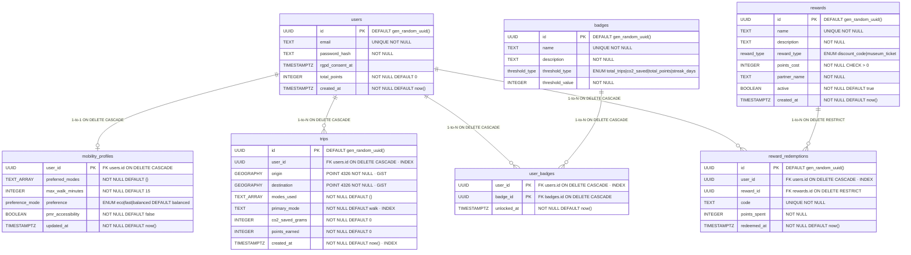

# E6, Schéma relationnel complet (ERD)

## Index

| Table | Colonne(s) | Type | Migration |
|---|---|---|---|
| `users` | `email` | B-tree UNIQUE | 002 |
| `trips` | `user_id` | B-tree | 004 |
| `trips` | `origin` | GiST PostGIS | 004 |
| `trips` | `destination` | GiST PostGIS | 004 |
| `trips` | `created_at` | B-tree | 004 |
| `trips` | `(user_id, primary_mode, created_at)` | B-tree composé | 012 |
| `user_badges` | `user_id` | B-tree | 006 |
| `reward_redemptions` | `user_id` | B-tree | 013 |

## Description du modèle

Le schéma s'organise autour de quatre entités racines. `users` porte l'identité et le solde de points cumulé (`total_points`), dénormalisé pour éviter un recalcul par agrégation à chaque affichage du tableau de bord. `mobility_profiles` est en relation 1-1 avec `users` : chaque utilisateur possède exactement un profil de mobilité, supprimé en cascade avec son compte.

`trips` enregistre chaque itinéraire effectué, avec les coordonnées d'origine et de destination en `GEOGRAPHY(POINT, 4326)` pour permettre des requêtes géospatiales (distance, recherche par rayon) via les index GiST. Seuls les indicateurs de synthèse utiles à la gamification et au tableau de bord sont persistés (`co2_saved_grams`, `points_earned`) : la durée, la distance et le score détaillés d'un itinéraire restent des valeurs calculées à la volée par le moteur de scoring, jamais stockées.

`badges` et `user_badges` modélisent la progression de gamification : `badges` définit un catalogue de paliers (nombre de trajets, CO2 économisé, points totaux, séquence de jours consécutifs) et `user_badges` matérialise le déverrouillage d'un badge par un utilisateur, avec une clé primaire composée `(user_id, badge_id)` qui interdit nativement le déverrouillage en double.

`rewards` et `reward_redemptions` modélisent la boutique de récompenses : `rewards` catalogue les récompenses disponibles auprès de partenaires (coût en points, type), et `reward_redemptions` trace chaque échange avec un code unique généré à l'échange. La suppression d'une récompense est bloquée (`ON DELETE RESTRICT`) tant que des échanges y font référence, ce qui préserve l'intégrité de l'historique.
