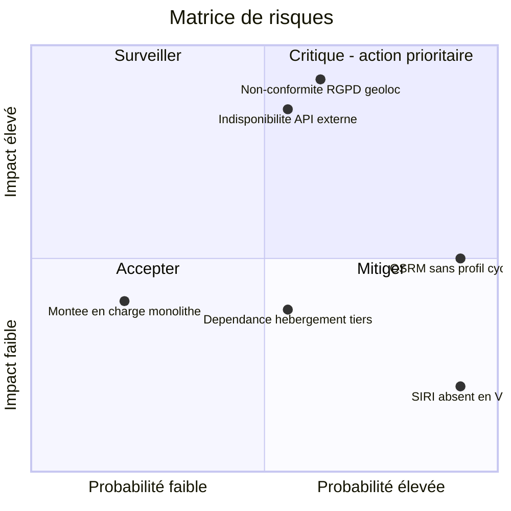
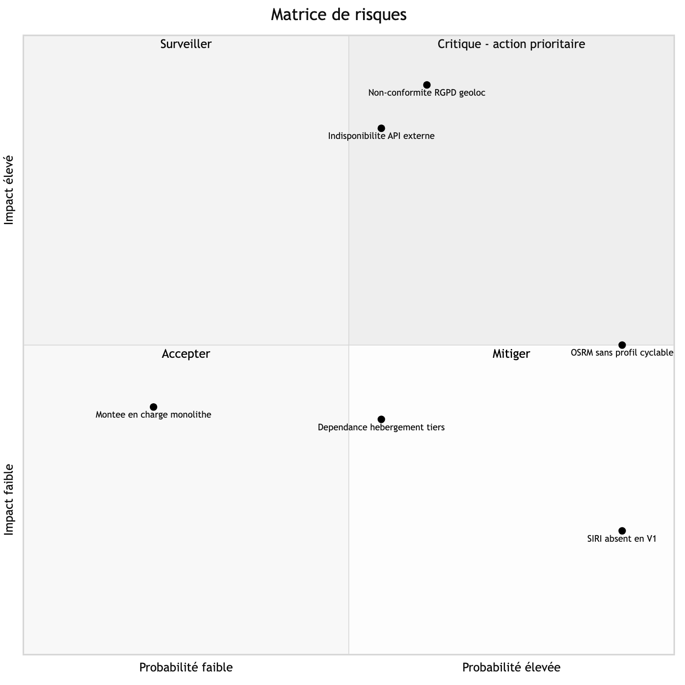

# H1, Matrice de risques

## Description

La matrice reprend les six risques du tableau de la section H1 sur les mêmes axes Probabilité/Impact, répartis en quatre zones d'action.

**Critique, action prioritaire (probabilité élevée, impact élevé).** L'indisponibilité d'une API externe et la non-conformité RGPD sur la géolocalisation sont les deux risques qui cumulent une probabilité significative et un impact élevé sur la livraison du MVP. Ce sont les seuls risques du registre pour lesquels une mitigation active est en place dès le développement (mode démo, timeout par provider, consentement explicite), et non reportée en réaction.

**Mitiger (probabilité élevée, impact modéré à faible).** La limitation du profil OSRM public au routage automobile et l'absence de données SIRI temps réel sont des contraintes avérées et documentées avant même le démarrage du développement : leur probabilité est maximale par construction, mais leur impact reste contenu par les approximations et fallbacks déjà en place (vitesses constantes par mode, horaires théoriques GTFS).

**Surveiller (probabilité faible, impact modéré).** La montée en charge dépassant la capacité du monolithe est peu probable sur la durée d'un MVP à faible base d'utilisateurs, mais son impact justifierait une réaction rapide si le besoin de scalabilité émergeait plus tôt que prévu.

**Accepter (probabilité et impact modérés).** La dépendance aux tiers gratuits d'hébergement (Vercel, Render, Supabase) est un risque structurel de tout prototype académique, dont l'impact est borné par l'architecture conteneurisée qui permet une migration sans réécriture applicative.
